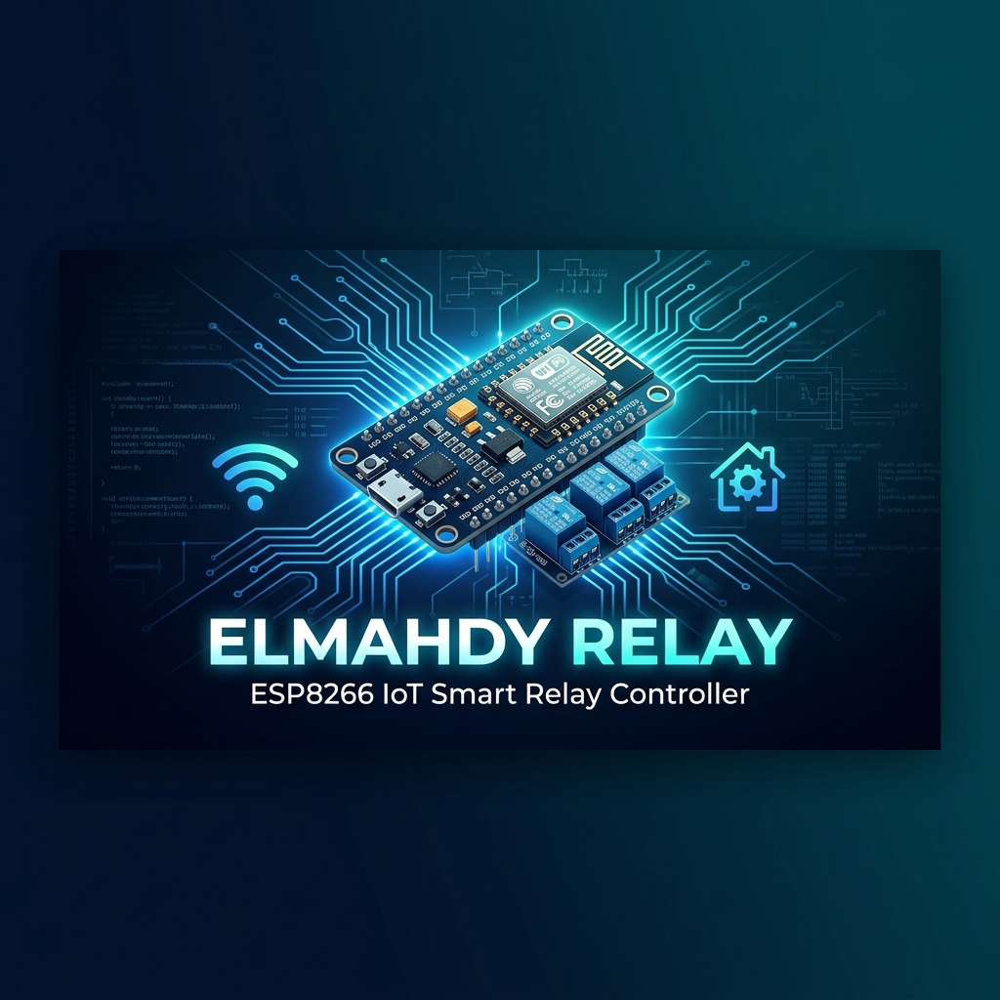

<p align="center">
  
</p>

<h1 align="center">⚡ Elmahdy Relay</h1>

<p align="center">
  <b>Production-Grade ESP8266 IoT Smart Relay Controller</b><br>
  <sub>1–4 Channel • Bilingual AR/EN • MQTT + Home Assistant • PWA • OTA Updates</sub>
</p>

<p align="center">
  <a href="#features"></a>
  <a href="#mqtt--home-assistant"></a>
  <a href="#bilingual-support"></a>
  <a href="#pwa-support"></a>
  <a href="LICENSE"></a>
  
  
</p>

---

## 📖 Table of Contents

- [Overview](#overview)
- [Features](#features)
- [Hardware Requirements](#hardware-requirements)
- [Wiring Diagram](#wiring-diagram)
- [Getting Started](#getting-started)
  - [Prerequisites](#prerequisites)
  - [Building from Source](#building-from-source)
  - [Flashing the Firmware](#flashing-the-firmware)
  - [First Boot & WiFi Setup](#first-boot--wifi-setup)
- [Usage Guide](#usage-guide)
  - [Dashboard](#dashboard)
  - [Relay Configuration](#relay-configuration)
  - [Timers & Schedules](#timers--schedules)
  - [Scene Presets](#scene-presets)
  - [MQTT & Home Assistant](#mqtt--home-assistant)
  - [Bilingual Support](#bilingual-support)
  - [OTA Firmware Update](#ota-firmware-update)
  - [Backup & Restore](#backup--restore)
  - [PWA Support](#pwa-support)
- [API Reference](#api-reference)
  - [REST API](#rest-api)
  - [WebSocket Protocol](#websocket-protocol)
  - [MQTT Topics](#mqtt-topics)
- [Architecture](#architecture)
- [Extending the Firmware](#extending-the-firmware)
  - [Adding a New Sensor](#adding-a-new-sensor)
  - [Adding a New API Endpoint](#adding-a-new-api-endpoint)
  - [Adding a New Language](#adding-a-new-language)
- [Configuration Files](#configuration-files)
- [Performance](#performance)
- [Contributing](#contributing)
- [License](#license)
- [Contact](#contact)

---

## Overview

**Elmahdy Relay** is a production-grade IoT smart relay controller built on the ESP8266 (ESP-12F / NodeMCU) platform. It provides a beautiful, fully bilingual (Arabic RTL / English LTR) web dashboard for controlling 1–4 relay channels over WiFi, with real-time WebSocket updates, MQTT integration for smart home systems like Home Assistant, countdown and scheduled timers, scene presets, and much more — all packed into a single flashable `.bin` file.

> **Why Elmahdy Relay?**
> - 🏭 **Production-ready** — Corruption-safe config storage, dual-bank OTA, hardware watchdog
> - 🌐 **Fully local** — No cloud dependency. Works on your local network, even without internet
> - 🇸🇦 **Arabic-first** — Full RTL Arabic UI with instant language switching to English
> - 📱 **PWA installable** — Add to home screen for an app-like experience
> - 🏠 **Home Assistant ready** — MQTT auto-discovery, zero config needed
> - ⚡ **Blazing fast** — Boot in <5s, UI loads in <2s, relay toggle in <100ms

---

## Features

### 🔌 Relay Control
- **1–4 configurable channels** with independent GPIO pin assignment
- **Power-on state** per channel: Last State, Always ON, or Always OFF
- **Interlock groups** — Only one relay ON at a time (safety for motors/curtains)
- **Pulse/Inching mode** — Auto-OFF after configurable duration (garage doors, gates)
- **Staggered activation** — 50ms delay between relays in bulk commands to prevent electrical surge
- **All ON / All OFF** bulk control
- **Boot-sensitive GPIO warning** — Warns if GPIO 0, 2, or 15 is selected

### ⏱️ Timers & Scheduling
- **Countdown timers** — "Turn OFF after 30 minutes"
- **Scheduled timers** — "Turn ON at 18:00 daily"
- **Repeat modes**: Once, Daily, Weekdays, Weekend, Custom days
- **NTP time sync** with configurable timezone
- **Power-cycle safe** — Timers persist and resume after reboot
- **Max 8 timers** total (countdown + scheduled)

### 🎭 Scene Presets
- **Named presets** grouping multiple relay states (e.g., "Night Mode")
- **Arabic & English names** supported
- **One-tap activation** from dashboard, MQTT, or PWA
- **Max 10 scenes**

### 📡 MQTT & Home Assistant
- **Full MQTT integration** with configurable broker, port, auth, and topic prefix
- **Home Assistant Auto-Discovery** — Devices appear automatically in HA
- **Last Will & Testament (LWT)** for online/offline status detection
- **Per-channel control & status topics**
- **Scene activation via MQTT**
- **System info topic** (firmware version, uptime, RSSI, IP)
- **Exponential backoff reconnect** — Never blocks local control

### 🌍 Bilingual Support
- **Full Arabic (RTL) and English (LTR)** with instant switching
- **No page reload** — Language toggle is instant
- **External language packs** — Easy to add new languages
- **Persistent preference** — Remembers your choice across reboots

### 📱 PWA Support
- **Add to Home Screen** on Android & iOS
- **Standalone mode** — Opens without browser chrome
- **Service worker** caches static assets for offline local network access

### 🔄 OTA Updates
- **Web UI firmware upload** — No USB cable needed after initial flash
- **File size validation** before flashing
- **Progress bar** during update
- **Dual-bank protection** — Power loss during OTA? Previous firmware is preserved
- **Config preserved** across firmware updates

### 💾 Backup & Restore
- **One-click backup** downloads all device config as a single file
- **Restore** to clone settings across devices or recover after factory reset

### 🔔 Hardware Feedback
- **Buzzer** — Beep on toggle, double-beep on WiFi connect, long beep on factory reset
- **LED status** — Fast blink (AP only), slow blink (WiFi connected), solid (MQTT connected)
- **Physical reset button** — Short press: toggle relay 1, long press: reboot, very long press: factory reset
- **Anti-spam protection** — 100ms minimum between buzzer activations
- **Graceful degradation** — Device works fine without buzzer/LED/button hardware

### 🛡️ Reliability
- **Corruption-safe writes** — Write to temp → CRC32 verify → atomic rename
- **Per-section factory defaults** — Only the corrupted config section resets
- **Hardware watchdog** — Auto-recovery from firmware hangs
- **AP always active** — Never lose access to your device
- **No `delay()` calls** — Fully non-blocking firmware

---

## Hardware Requirements

| Component | Specification | Notes |
|-----------|--------------|-------|
| **MCU** | ESP8266 (ESP-12F) or NodeMCU v2 | 4MB flash required |
| **Relay Module** | 1–4 channel relay board | Active-LOW (default) |
| **Power Supply** | 5V DC, ≥1A | Powers both MCU and relays |
| **Buzzer** *(optional)* | Active buzzer, 3.3V | Connected to GPIO13 (D7) |
| **Reset Button** *(optional)* | Momentary push button | Connected to GPIO16 (D0) |

---

## Wiring Diagram

### Default GPIO Pin Assignment

| Function | GPIO | NodeMCU Pin | Notes |
|----------|------|-------------|-------|
| Relay 1 | GPIO5 | D1 | ✅ Boot-safe |
| Relay 2 | GPIO4 | D2 | ✅ Boot-safe |
| Relay 3 | GPIO14 | D5 | ✅ Boot-safe |
| Relay 4 | GPIO12 | D6 | ✅ Boot-safe |
| Buzzer | GPIO13 | D7 | Active buzzer |
| Reset Button | GPIO16 | D0 | Pull-up to 3.3V |
| Status LED | GPIO2 | D4 | Built-in LED (active-LOW) |

> [!IMPORTANT]
> **GPIO 0, 2, and 15** are boot-sensitive. Avoid using them for relays unless you understand the implications. The firmware will warn you if you try.

---

## Getting Started

### Prerequisites

1. **PlatformIO** — Install [PlatformIO IDE](https://platformio.org/install) (VS Code extension) or PlatformIO Core (CLI)
2. **Python `intelhex` package** — Required for binary merge (one-time setup):
   ```bash
   %USERPROFILE%\.platformio\penv\Scripts\pip.exe install intelhex
   ```
3. **Tasmotizer** *(optional)* — GUI tool for flashing: [Download Tasmotizer](https://github.com/tasmota/tasmotizer/releases)

### Building from Source

Clone this repository and build:

```bash
# Clone the repo
git clone https://github.com/Sayedelmahdy/Elmahdy-Relay.git
cd Elmahdy-Relay/firmware

# Build firmware
pio run

# Build LittleFS filesystem image (web UI + language files)
pio run --target buildfs
```

Or use the included build script (Windows PowerShell):

```powershell
cd firmware
.\build.ps1
```

### Flashing the Firmware

#### Option 1: Tasmotizer (GUI — Recommended for First Flash)

1. Build the merged binary:
   ```bash
   # From the firmware/ directory
   pio run && pio run --target buildfs
   
   # Merge into single .bin
   python -m esptool --chip esp8266 merge_bin \
     --flash_mode dio --flash_freq 80m --flash_size 4MB \
     -o elmahdy-relay-full.bin \
     0x000000 .pio/build/nodemcuv2/firmware.bin \
     0x200000 .pio/build/nodemcuv2/littlefs.bin
   ```
2. Open **Tasmotizer**
3. Select your **COM port**
4. Browse to `elmahdy-relay-full.bin`
5. ✅ Check **"Erase before flashing"** (first time only)
6. Click **"Tasmotize!"**

#### Option 2: Command Line

```bash
# Erase flash (first time only)
pio run --target erase --upload-port COM3

# Flash firmware + filesystem
pio run --target upload --upload-port COM3
pio run --target uploadfs --upload-port COM3
```

#### Option 3: OTA Update (after initial flash)

Navigate to **System Settings → Firmware Update** in the web UI and upload the `.bin` file.

### First Boot & WiFi Setup

1. **Power on** the device
2. **Connect** your phone/laptop to WiFi network: `ElmahdyRelay_XXXX` (password: `12345678`)
3. A **captive portal** will redirect you to `http://192.168.4.1`
4. The setup page loads in **Arabic** by default
5. Tap **"بحث عن الشبكات"** (Scan Networks) to find your home WiFi
6. Select your network, enter the password, and save
7. The device connects to your home WiFi while keeping the AP active
8. Access the dashboard via the device's **new IP** (shown after connecting) or via `http://192.168.4.1`

> [!TIP]
> The AP is **always active** — you can always access the device at `192.168.4.1` even if your home WiFi goes down.

---

## Usage Guide

### Dashboard

The main dashboard shows:
- **Relay cards** with toggle switches for each channel
- **All ON / All OFF** bulk control buttons
- **Scene preset** quick-activate buttons
- **System info**: WiFi signal (RSSI bars), uptime, MQTT status, firmware version
- **Language toggle** (AR/EN) in the header

All state changes are **real-time** via WebSocket — no page refresh needed. Multiple users can control the device simultaneously.

### Relay Configuration

Navigate to **Configuration → Relay Settings**:

- Set **number of active channels** (1–4)
- Assign **GPIO pin** per channel
- Set **channel name** (up to 20 characters, Arabic or English)
- Configure **power-on state**: Last State / Always ON / Always OFF
- Enable **pulse mode** with configurable duration
- Set up **interlock groups** (mutually exclusive relays)

### Timers & Schedules

Navigate to **Configuration → Timers**:

#### Countdown Timer
- Select a channel and target state (ON/OFF)
- Set duration (minutes)
- Timer persists across reboots

#### Scheduled Timer
- Select a channel and target state
- Set the time (HH:MM)
- Choose repeat mode: Once / Daily / Weekdays / Weekend / Custom days
- Requires NTP time sync (pauses if NTP is unavailable)

### Scene Presets

Navigate to **Configuration → Scenes**:

- Create named scenes with specific relay states per channel
- Names support Arabic and English
- Trigger scenes from the dashboard, MQTT, or PWA
- Maximum 10 scenes

### MQTT & Home Assistant

Navigate to **Configuration → MQTT**:

| Setting | Default | Description |
|---------|---------|-------------|
| Broker | `broker.hivemq.com` | MQTT broker address |
| Port | `1883` | Broker port |
| Username | *(empty)* | Auth username |
| Password | *(empty)* | Auth password |
| Prefix | `elmahdy` | Topic prefix |

#### Home Assistant Auto-Discovery

When MQTT is enabled, the device automatically publishes **HA discovery messages** on boot. Your relays appear in Home Assistant with zero additional configuration.

### Bilingual Support

- Tap the **AR/EN** button in the header to switch languages
- Arabic activates **full RTL layout**
- English activates **LTR layout**
- Switch is **instant** — no page reload
- Preference persists across sessions and reboots

### OTA Firmware Update

1. Go to **System Settings → Firmware Update**
2. Click **Browse** and select the new `.bin` file
3. The firmware validates the file size
4. A **progress bar** shows during flashing
5. Device **auto-reboots** after success
6. All your **settings are preserved**

> [!NOTE]
> If power is lost during OTA, the **dual-bank protection** preserves the previous working firmware.

### Backup & Restore

- **Backup**: System Settings → Download Backup (exports all config as a single file)
- **Restore**: System Settings → Upload Restore file → Device reboots with restored settings

Useful for cloning settings across multiple devices.

### PWA Support

On **Android Chrome** or **iOS Safari**:
1. Open the dashboard URL
2. Browser prompts **"Add to Home Screen"**
3. The app installs and opens in **standalone mode** (no browser chrome)
4. Cached assets work on local network even without internet

---

## API Reference

### REST API

All endpoints support **CORS** for external application access.

| Method | Endpoint | Description |
|--------|----------|-------------|
| `GET` | `/api/status` | Full device status (relays, WiFi, MQTT, system) |
| `GET` | `/api/relays` | Relay states for all channels |
| `POST` | `/api/relay/{ch}` | Toggle relay (body: `{"state": "ON"/"OFF"/"TOGGLE"}`) |
| `POST` | `/api/relay/all` | All ON/OFF (body: `{"state": "ON"/"OFF"}`) |
| `GET` | `/api/timers` | List all timers |
| `POST` | `/api/timer` | Create a timer |
| `DELETE` | `/api/timer/{id}` | Delete a timer |
| `GET` | `/api/scenes` | List all scenes |
| `POST` | `/api/scene` | Create/update a scene |
| `POST` | `/api/scene/{name}/activate` | Activate a scene |
| `DELETE` | `/api/scene/{name}` | Delete a scene |
| `GET` | `/api/config/wifi` | Get WiFi configuration |
| `POST` | `/api/config/wifi` | Save WiFi configuration |
| `GET` | `/api/config/mqtt` | Get MQTT configuration |
| `POST` | `/api/config/mqtt` | Save MQTT configuration |
| `GET` | `/api/config/relays` | Get relay configuration |
| `POST` | `/api/config/relays` | Save relay configuration |
| `GET` | `/api/config/system` | Get system configuration |
| `POST` | `/api/config/system` | Save system configuration |
| `GET` | `/api/scan` | Scan WiFi networks |
| `POST` | `/api/ota` | Upload firmware (multipart) |
| `GET` | `/api/backup` | Download full config backup |
| `POST` | `/api/restore` | Upload and restore config backup |
| `POST` | `/api/factory-reset` | Factory reset the device |
| `POST` | `/api/reboot` | Reboot the device |

### WebSocket Protocol

Connect to `ws://<device-ip>/ws` for real-time bidirectional communication.

**Server → Client Messages:**
```json
{"type": "relay_state", "channel": 1, "state": "ON"}
{"type": "all_state", "relays": [{"ch": 1, "state": "ON"}, {"ch": 2, "state": "OFF"}]}
{"type": "timer_update", "timers": [...]}
{"type": "system_info", "uptime": 3600, "rssi": -45, "mqtt": true}
```

**Client → Server Commands:**
```json
{"action": "toggle", "channel": 1}
{"action": "set", "channel": 1, "state": "ON"}
{"action": "all_on"}
{"action": "all_off"}
{"action": "scene", "name": "night"}
```

### MQTT Topics

Default prefix: `elmahdy`

| Topic | Direction | Payload | Description |
|-------|-----------|---------|-------------|
| `{prefix}/relay/{ch}/control` | Subscribe | `ON` / `OFF` / `TOGGLE` | Control a relay |
| `{prefix}/relay/{ch}/status` | Publish | `ON` / `OFF` | Relay state feedback |
| `{prefix}/scene/{name}/control` | Subscribe | `ON` | Activate a scene |
| `{prefix}/status` | Publish | `online` / `offline` | LWT availability |
| `{prefix}/system` | Publish | JSON | System info (version, uptime, RSSI, IP) |
| `homeassistant/switch/...` | Publish | JSON | HA auto-discovery config |

---

## Architecture

```
┌─────────────────────────────────────────────────────────┐
│                      ESP8266 Firmware                    │
│                                                         │
│  ┌─────────────┐  ┌──────────────┐  ┌───────────────┐  │
│  │ WiFi Manager│  │  Web Server  │  │ MQTT Manager  │  │
│  │  (AP+STA)   │  │(ESPAsyncWeb) │  │(AsyncMqttCli) │  │
│  └──────┬──────┘  └──────┬───────┘  └──────┬────────┘  │
│         │                │                  │           │
│         │         ┌──────┴───────┐          │           │
│         │         │  WebSocket   │          │           │
│         │         │   Handler    │          │           │
│         │         └──────┬───────┘          │           │
│         │                │                  │           │
│  ┌──────┴────────────────┴──────────────────┴────────┐  │
│  │              Relay Controller                     │  │
│  │     (GPIO control, interlock, pulse, state)       │  │
│  └──────┬──────────────────────────────┬─────────────┘  │
│         │                              │                │
│  ┌──────┴──────┐              ┌────────┴────────┐       │
│  │Timer Engine │              │ Scene Manager   │       │
│  │(countdown + │              │ (presets, CRUD)  │       │
│  │ scheduled)  │              └─────────────────┘       │
│  └─────────────┘                                        │
│                                                         │
│  ┌─────────────┐  ┌──────────────┐  ┌───────────────┐  │
│  │   Config    │  │   Language   │  │    Buzzer /    │  │
│  │  Manager    │  │   Manager    │  │  LED / Reset   │  │
│  │ (LittleFS)  │  │ (AR/EN packs)│  │  Controllers   │  │
│  └─────────────┘  └──────────────┘  └───────────────┘  │
└─────────────────────────────────────────────────────────┘
```

### Module Overview

| Module | File | Responsibility |
|--------|------|---------------|
| **WiFi Manager** | `wifi_manager.h/.cpp` | AP+STA mode, captive portal, WiFi scanning |
| **Web Server** | `web_server.h/.cpp` | HTTP routes, static file serving, CORS |
| **WebSocket Handler** | `websocket_handler.h/.cpp` | Real-time bidirectional communication |
| **MQTT Manager** | `mqtt_manager.h/.cpp` | Broker connection, HA discovery, LWT |
| **Relay Controller** | `relay_controller.h/.cpp` | GPIO control, interlock, pulse, state |
| **Timer Engine** | `timer_engine.h/.cpp` | Countdown + scheduled timers, NTP sync |
| **Scene Manager** | `scene_manager.h/.cpp` | Scene CRUD, activation |
| **Config Manager** | `config_manager.h/.cpp` | LittleFS JSON storage, CRC32, atomic writes |
| **Language Manager** | `language_manager.h/.cpp` | Language pack loading, string lookup |
| **Buzzer Controller** | `buzzer_controller.h/.cpp` | Beep patterns, anti-spam |
| **LED Controller** | `led_controller.h/.cpp` | Status LED patterns |
| **Reset Handler** | `reset_handler.h/.cpp` | Button press duration detection |

---

## Extending the Firmware

This firmware is designed to be modular. Here's how to extend it:

### Adding a New Sensor

1. **Create the module** — Add `sensor_name.h` and `sensor_name.cpp` in `firmware/src/`
2. **Follow the pattern** — Look at existing modules like `buzzer_controller.h/.cpp` for structure:
   ```cpp
   // sensor_name.h
   #ifndef SENSOR_NAME_H_
   #define SENSOR_NAME_H_
   
   namespace SensorName {
       void begin();        // Called once in setup()
       void loop();         // Called every loop() iteration
       float readValue();   // Your sensor-specific function
   }
   
   #endif
   ```
3. **Register in `main.cpp`** — Add `#include "sensor_name.h"` and call `SensorName::begin()` in `setup()`, `SensorName::loop()` in `loop()`
4. **Add API endpoint** — In `web_server.cpp`, add a route:
   ```cpp
   server.on("/api/sensor", HTTP_GET, [](AsyncWebServerRequest *request) {
       // Return sensor data as JSON
   });
   ```
5. **Add WebSocket updates** — In `websocket_handler.cpp`, broadcast sensor data
6. **Add MQTT topic** — In `mqtt_manager.cpp`, publish sensor readings
7. **Update the UI** — Add a card in `index.html` and update `app.js`

### Adding a New API Endpoint

In `web_server.cpp`:
```cpp
server.on("/api/your-endpoint", HTTP_GET, [](AsyncWebServerRequest *request) {
    JsonDocument doc;
    doc["key"] = "value";
    String response;
    serializeJson(doc, response);
    request->send(200, "application/json", response);
});
```

### Adding a New Language

1. Copy `firmware/data/lang_en.json` to `firmware/data/lang_xx.json`
2. Translate all string values
3. Add the language option in `language_manager.cpp`
4. Update the UI toggle in `index.html`

---

## Configuration Files

All configuration is stored in **LittleFS** as separate JSON files with corruption-safe write patterns:

| File | Contents |
|------|----------|
| `wifi.json` | SSID, password, static IP settings, AP password |
| `mqtt.json` | Broker, port, auth, prefix, enabled state |
| `relays.json` | Channel count, GPIO pins, names, power-on states, pulse, interlock |
| `timers.json` | All countdown and scheduled timers |
| `scenes.json` | All scene presets |
| `system.json` | Buzzer/LED/reset settings, hostname, language, timezone |

> [!NOTE]
> **Write safety**: All config writes use a `write-to-temp → CRC32 verify → atomic rename` pattern. If power is lost during a write, the previous valid config remains intact.

---

## Performance

| Metric | Target | Achieved |
|--------|--------|----------|
| Boot to functional state | < 5 seconds | ✅ |
| Web UI load time | < 2 seconds | ✅ |
| Relay toggle latency | < 100ms | ✅ |
| WebSocket state push | < 50ms | ✅ |
| Firmware binary size | < 500KB | ✅ |
| Web assets + config | < 512KB | ✅ |
| Config persistence | 100+ power cycles | ✅ |
| Concurrent WebSocket clients | 4 | ✅ |

---

## Contributing

Contributions are welcome! Here's how to get started:

1. **Fork** this repository
2. **Create a feature branch**: `git checkout -b feature/my-new-sensor`
3. **Follow the code style** — Look at existing modules for patterns
4. **Test on hardware** — This is embedded firmware, always test on real ESP8266
5. **Keep it lightweight** — Remember the 500KB firmware + 512KB filesystem budget
6. **Submit a Pull Request** with a clear description

### Development Tips

- Use `monitor_speed = 115200` for serial debugging
- Use `monitor_filters = esp8266_exception_decoder` for crash stack traces
- The firmware uses **no `delay()` calls** — keep all code non-blocking
- All web assets use **vanilla ES5 JavaScript** — no frameworks, no transpilers
- Compress web assets with gzip for LittleFS deployment

### Areas for Contribution

- 🌡️ **Sensor integrations** (DHT22, BMP280, current sensors, etc.)
- 🌐 **Additional languages** (French, Turkish, Urdu, etc.)
- 📊 **Energy monitoring** features
- 🔐 **Optional authentication** for the web UI
- 📱 **Mobile app** (React Native / Flutter)
- 🧪 **Automated testing** framework

---

## License

This project is licensed under the **MIT License** — see the [LICENSE](LICENSE) file for details.

---

## Contact

**Sayed Elmahdy**

- 📱 Phone: 01093307397
- 🐙 GitHub: [@Sayedelmahdy](https://github.com/Sayedelmahdy)

---

<p align="center">
  <b>Made with ❤️ by Sayed Elmahdy</b><br>
  <sub>© 2026 Elmahdy Relay — All rights reserved</sub>
</p>
